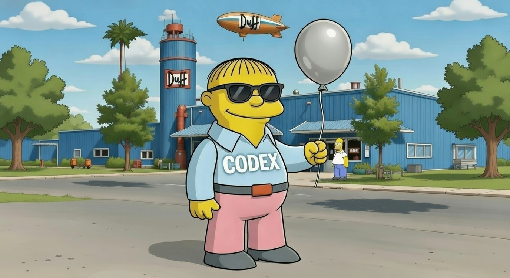
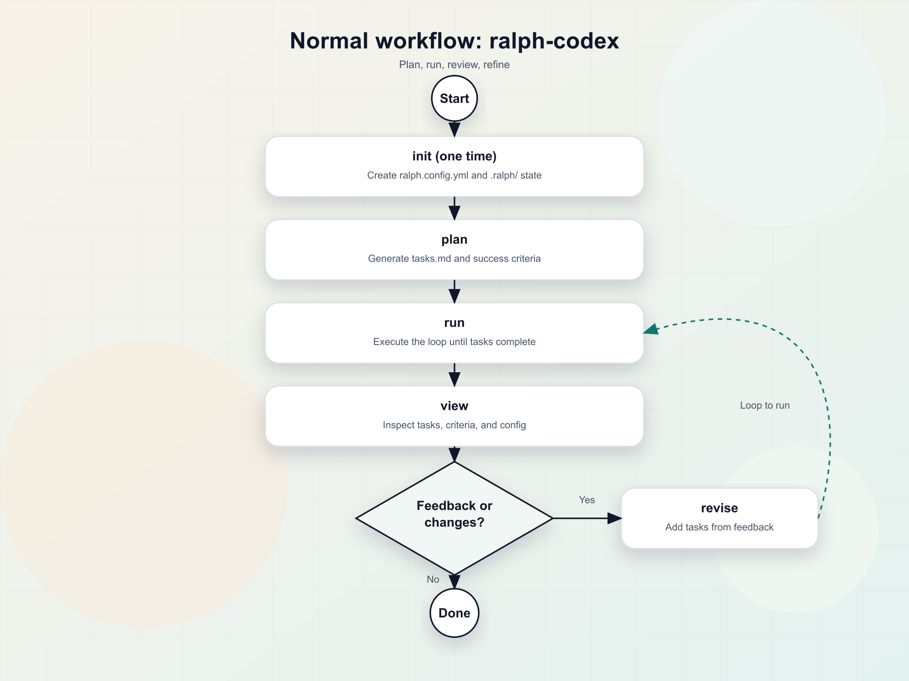

# ralph-codex



Codex-first Ralph-style planning and run loops.

## What it does

- Turns an idea into a task plan (`tasks.md`) with one round of questions.
- Runs the loop until completion, keeping state in `.ralph/`.
- Optional Docker mode for reproducible runs.
- Colorized Codex output in TTY for easier scanning (disable with `NO_COLOR=1`).

## How it works

- `plan` asks for success criteria, runs Codex, and writes `tasks.md`.
- `run` executes tasks until `LOOP_COMPLETE`, updating `.ralph/` state and logs.
- `revise` adds new tasks from feedback without touching existing items.
- `view` and `reset` help you inspect and reset task status.



## Requirements

- Node.js >= 18
- Codex CLI installed and authenticated (`codex` available in PATH)
- Docker (optional, only for Docker mode)

## Codex CLI setup

Install and verify:

```bash
npm install -g @openai/codex
codex --help
```

Authenticate using the Codex CLI and/or create a profile in `~/.codex/config.toml`.
Follow the auth guide at https://developers.openai.com/codex/auth.
If you use profiles, pass `--profile` or set `codex.profile` in `ralph.config.yml`.

## Install

```bash
npm install -g ralph-codex
# or
npx ralph-codex --help
```

## Quick start

```bash
ralph-codex init
ralph-codex plan "Add screenshot flow for /demo" --output tasks.md
ralph-codex run
ralph-codex revise "Improve the flow after QA"
ralph-codex view
ralph-codex reset
```

## Demo (sample output)

```text
$ ralph-codex plan "Add screenshot flow"
... (interactive prompts) ...
tasks.md written
$ ralph-codex run
... (loop output) ...
LOOP_COMPLETE
```

## Cookbook

### Basic flow

```bash
ralph-codex init
ralph-codex plan "Add screenshot flow for /demo" --output tasks.md
ralph-codex run --max-iterations 10
```

### Docker flow

```bash
ralph-codex docker
# Ensure docker.codex_install is set in ralph.config.yml
ralph-codex plan "Add screenshot flow for /demo"
ralph-codex run
```

### Low-touch automation (still interactive)

Use a prefilled config and pass flags to minimize prompts. This CLI still expects a TTY.

```bash
ralph-codex plan "Add screenshot flow" --full-auto --reasoning low
ralph-codex run --full-auto --reasoning low
```

## Command reference

Use `--help` with any command to see its available options.

### init

Create `ralph.config.yml` and add `.ralph` to `.gitignore`.
Init is interactive and prompts for Codex settings and Docker usage.

```bash
ralph-codex init [--force] [--config <path>] [--no-gitignore]
```

### plan

Generate `tasks.md` with one round of questions.

```bash
ralph-codex plan "<idea>" [--output <path>] [--tasks <path>] [--max-iterations <n>]
```

Common options:

- `--output <path>` write tasks to a custom file (alias of `--tasks`).
- `--config <path>` use a custom config file.
- `--model <name>` or `-m` set the Codex model.
- `--profile <name>` or `-p` use a Codex CLI profile.
- `--sandbox <mode>` set sandbox mode.
- `--ask-for-approval <mode>` set approval policy.
- `--full-auto` use workspace-write + on-request.
- `--reasoning [effort]` override reasoning effort; omit value to pick from a list (defaults to medium).
- `--detect-success-criteria` add auto-detected checks to the success list.
- `--no-detect-success-criteria` disable auto-detect (overrides config).
- In the interactive checklist, choose `Ask Codex to choose` to let Codex derive success criteria.

### run

Execute the loop until completion.

```bash
ralph-codex run [--input <path>] [--tasks <path>] [--max-iterations <n>]
```

Useful options:

- `--input <path>` read tasks from a custom file (alias of `--tasks`).
- `--quiet` reduce output.
- `--max-iteration-seconds <n>` soft per-iteration limit (stop after current loop).
- `--max-total-seconds <n>` hard total limit (kills in-flight loop).
- `--completion-promise <text>` change the completion marker.
- `--stop-on-error` stop on the first error.
- `--no-tail` disable log/scratchpad tailing.
- `--reasoning [effort]` override reasoning effort; omit value to pick from a list (defaults to medium).

### revise

Add new tasks from feedback without changing existing tasks.

```bash
ralph-codex revise "<feedback>" [--tasks <path>] [--run]
```

Useful options:

- `--tasks <path>` point to a custom tasks file.
- `--config <path>` use a custom config file.
- `--reasoning [effort]` override reasoning effort; omit value to pick from a list.
- `--run` run after approving the changes.

### view

Show tasks, success criteria, and config summaries.

```bash
ralph-codex view [section] [--format table|list|json]
```

Sections:

- `tasks` shows task status counts and list.
- `criteria` shows the success criteria list.
- `config` shows effective config values.

Useful options:

- `--tasks <path>` point to a custom tasks file.
- `--config <path>` use a custom config file.
- `--format <format>` table | list | json (default: table).
- `--only <filter>` pending | blocked | done (tasks only).
- `--limit <n>` limit task rows (0 = no limit).
- `--watch`, `-w` watch for changes and refresh the view.

### reset

Reset all tasks in `tasks.md` to `[ ]`.
Uses `plan.tasks_path` or `run.tasks_path` when set, unless overridden.

```bash
ralph-codex reset [--tasks <path>] [--config <path>]
```

### docker

Ask Codex for a base image and update Docker config.

```bash
ralph-codex docker [--config <path>]
```

## Configuration

The CLI reads `ralph.config.yml` in the project root. Use `--config <path>` to point elsewhere.
Run `ralph-codex init` to generate the full config. Example of the most common fields:

```yaml
version: 1

codex:
  model: gpt-5-codex
  profile: default
  sandbox: workspace-write
  ask_for_approval: on-request
  model_reasoning_effort: medium # or null to use Codex default

docker:
  enabled: false
  use_for_plan: false
  base_image: node:20-bullseye
  codex_install: npm install -g @openai/codex

plan:
  auto_detect_success_criteria: false
  tasks_path: tasks.md

run:
  max_iterations: 15
  max_iteration_seconds: null
  max_total_seconds: null
  completion_promise: LOOP_COMPLETE
```

Codex settings quick guide:
- `profile` selects a Codex CLI profile (default `null`, uses Codex default).
- `sandbox` sets permission mode (`read-only`, `workspace-write`, `danger-full-access`; default `null`).
- `ask_for_approval` controls prompt behavior (`untrusted`, `on-failure`, `on-request`, `never`; default `null`).
- `full_auto` is a convenience preset for `workspace-write` + `on-request` (default `false`).
- `model_reasoning_effort` chooses reasoning level (`low`, `medium`, `high`, `xhigh`; default `null`).

Enable `plan.auto_detect_success_criteria` to add detected checks based on repo files.

CLI flags always override config values.

## Defaults

Defaults are from the template `ralph.config.yml`.

| Setting | Default | Details |
| --- | --- | --- |
| `plan.tasks_path` | `tasks.md` | Output path for generated tasks. |
| `plan.auto_detect_success_criteria` | `false` | Detect and suggest checks from the repo. |
| `run.tasks_path` | `tasks.md` | Input path for tasks during runs. |
| `run.max_iterations` | `15` | Max loop iterations before stopping. |
| `run.completion_promise` | `LOOP_COMPLETE` | Completion token printed by the loop. |
| `docker.enabled` | `false` | Enable Docker execution. |
| `docker.use_for_plan` | `false` | Run planning inside Docker too. |

## Docker mode

1. Run `ralph-codex docker` to pick a base image.
2. Set `docker.codex_install` so Codex is available inside the container.
3. Run `ralph-codex plan` and `ralph-codex run` as usual. Enable `docker.use_for_plan`
   if you want planning to happen inside Docker as well.

Why Docker (especially with `danger-full-access`):
- Isolation: lets you grant broad permissions inside the container without exposing your host.
- Reproducibility: consistent OS/package stack across runs and teammates.
- Safer cleanup: delete the container/image to reset state.

Why `danger-full-access`:
- Fewer approval prompts for tooling that needs broad filesystem or network access.
- Works better for complex build/test flows that span many paths.
- Faster iterations when you trust the environment (best paired with Docker).

> **Warning**: Avoid `danger-full-access` on your host unless you fully trust the prompts,
> scripts, and dependencies. It grants broad access to your machine and can write
> outside the repo. Prefer Docker when you need this mode.

`Dockerfile.ralph` is generated automatically when Docker is enabled.

## Files created

- `ralph.config.yml` default config file.
- `tasks.md` planning output (configurable).
- `.ralph/` run state, summaries, and logs.

## Output styling

Codex output is colorized when stdout is a TTY. Plan uses spinners and run shows a task
progress bar when interactive. Set `NO_COLOR=1` to disable color styling.

## Exit codes

- `0` success.
- `1` invalid usage or runtime error.

## Troubleshooting

- `codex: command not found` -> install Codex CLI and ensure it is in PATH.
- Auth errors (401/403) -> authenticate Codex CLI or select a valid profile.
- `Missing tasks.md` -> run `ralph-codex plan` first or pass `--tasks`.
- Docker errors -> start Docker Desktop/Colima and retry.
- Config read errors -> verify `ralph.config.yml` path or pass `--config`.

## Changelog and license

- Changelog: `CHANGELOG.md`
- License: `LICENSE` (MIT)

## Privacy

ralph-codex does not add its own telemetry. It sends prompts and context to the Codex CLI you configure; follow your Codex policies and settings.
